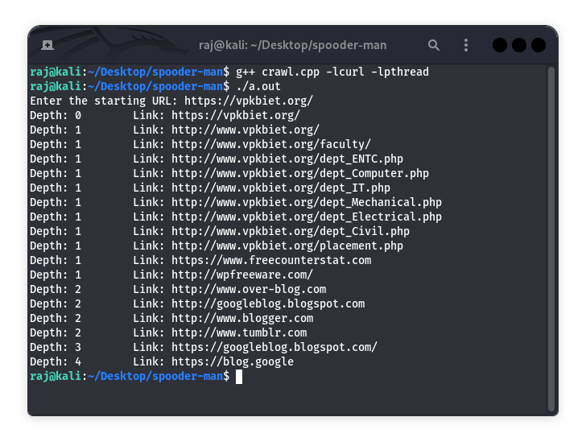

# Spooder-Man — Web Crawler in C++

Spooder-Man is a multithreaded web crawler written in C++ using libcurl and POSIX threads. It was developed as part of a Data Structures project to demonstrate the use of graphs, queues, sets, and concurrency.

## Key Features

- Breadth-first traversal (BFS) of web links  
- URL deduplication using std::set  
- Multithreaded crawling with POSIX pthread  
- Queue-based scheduling using std::queue  

## System Requirements

Tested on Ubuntu/Kali Linux.

Install required packages:

```bash
sudo apt update
sudo apt install curl g++ libcurl4-openssl-dev
````

## Build Instructions

Compile the code using:

```bash
g++ crawl.cpp -lcurl -lpthread
```

This will generate an executable named `a.out`.

## How to Run

Run the program with:

```bash
./a.out
```

Enter the starting URL when prompted. The crawler will explore and print links using BFS traversal.

## Concepts Demonstrated

* Graph traversal (BFS)
* Concurrency with threads
* URL deduplication with sets
* Queue-based crawl control

## Example Output



